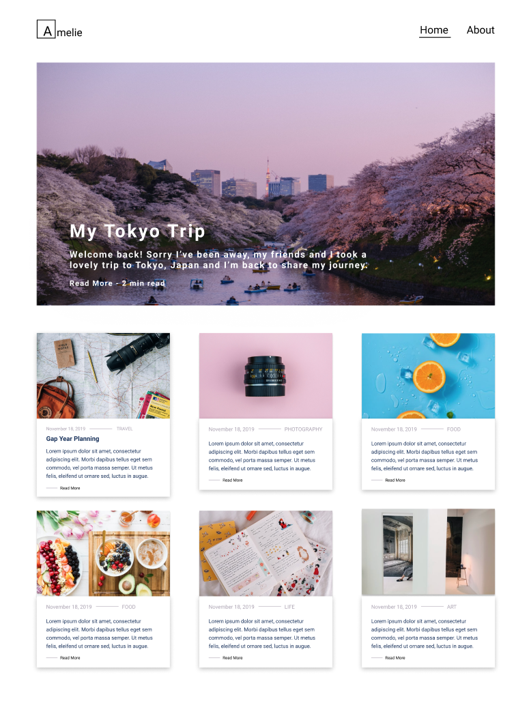
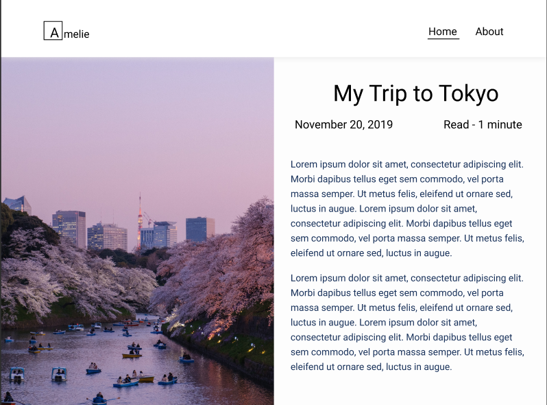
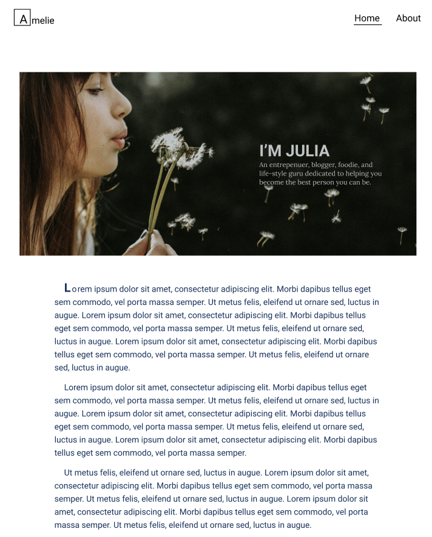
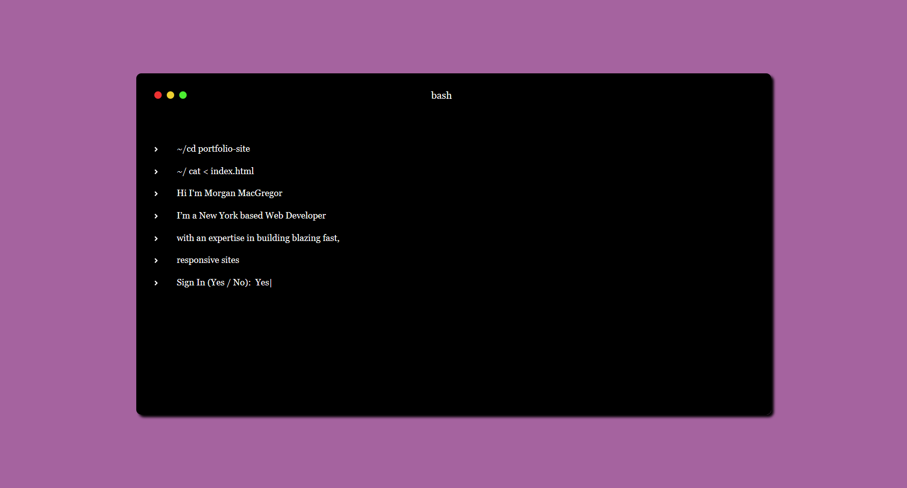
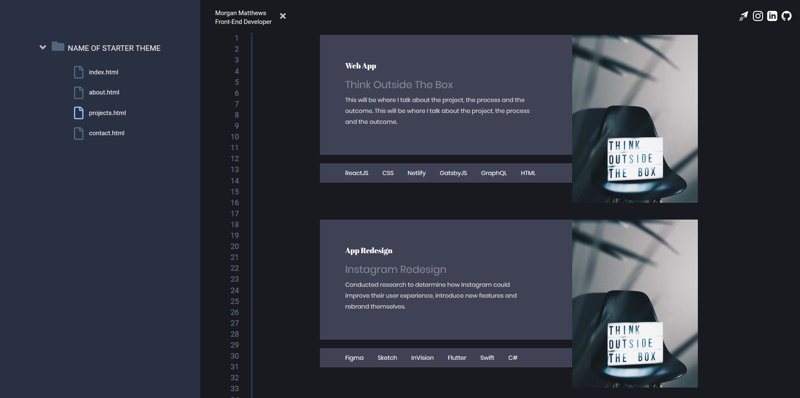

 

## Tom Callaway's Blog Post 

Tom Callaway brings up a point that the most successful company in the open source space is Red Hat, and not a company that follows the open core model. His point emphasizes his confusion as to why there are more open core models even though the most successful company uses the open source model. 
> The open core model has always seemed odd to me, a sort of “half-pregnant” state. On one hand, companies must believe there is value in the open source development model, otherwise, why not simply work from an entirely proprietary stack?  

The open core model seems like it's for companies that see a future in open source but doesn't want to full commit; to have minimal risks. I agree with Tom when he says "Proprietary software requires that your profits are invested in a linear model." and that working with open source software requires profits to be invested in a similar manner. The same commitment must be applied to all software, proprietary or open source, for a project to flourish. When comparing the two models, open source will definitely have more profits due to the fact that there will be more developers and contributers working on the project. 

 

## 8 Advantages of using open source in the enterprise
**This article is intended to convince CIO's about the importance of open source for companies**
1. FLEXIBILITY AND AGILITY
2. SPEED
3. COST-EFFECTIVENESS
4. ABILITY TO START SMALL
5. SOLID INFORMATION SECURITY
6. ATTRACT BETTER TALENT
7. SHARE MAINTENANCE COSTS
8. THE FUTURE

I agree that open source projects essentially have all of these 8 advantages. With the option of having a plethora of developers and contributers, the progress of the project will be faster and debugging will be faster as well. Open source gives the opportunity of attracting better talent because it gives developers the flexibility and freedom to work on projects. Ultimately, open source introduces many benefits that can help accelerate projects. 

 

## Would you want to work in a company that only produced open source software? Why or why not? What would your dream job be? How would you like to see the business of software production in ten years? 
- I don't have a strong passion to strictly work for a company that only produced open source software, but I wouldn't mind if that was the case. So, I would work for that company depending on if their mission aligns with my morals and interests. 
- I'm not sure what my dream job would be at the moment, but certainly a job that makes me happy with no regrets. 
- I would like to see more companies converting from proprietary to open source software. It would certainly increase the productivity and progress of the open source project. 

 

## Open Source Humanitarian
**Hackathons bring open source innovation to humanitarian aid**  
I think bringing up the topic of humaitarian aid to hackathons is a great idea because that's where a lot of creative ideas and solutions are created. Since a lot students attend hackathons, it's also a great place to impact the younger generation to be more aware humanitarian issues and their awareness will possibly bring positive change to the world. The article provides concepts created at hackathons that has then been picked up by organizations and companies, which shows organizations how tech volunteers can help improve their work. 

### Some projects  
**A response to "Doctors Without Borders" challenges**
- Showed how temperature sensors in the medicine supply chain can bring attention to cooling malfunctions, which is a common and very expensive real-world issue.
- The concept was picked up by Doctors Without Borders and is being used as a basis for discussion of how the idea can be developed further.

**Another proof of concept**
- Was created with the help of Node-RED and IBM BlueMix services to help structure data to Ushahidi, as a lot of incoming data is unstructured and needs to be better prepared to allow for proper analysis.

 

## Gatsby Progress For The Week ~ Blog Website
✅ Style blog post page  
✅ Create about page  
✅ Create footer  
✅ Add documentation for theme  
✅ Update contributions list  
✅ Deploy using Netlify  
✅ Make a PR  
🎉 PR successfully merged! 

## Some mockups Jessica and I created and designed  

The only slight difference between the mockups and the actual website is that  
1. The website is also mobile responsive and we skipped desigining a mockup for that because I thought it would be faster to start developing. Honestly, I personally like the mobile view a lot more than desktop/PC view  
2. The website does not have the Amelie logo  
3. Website has additional social media icons on the bottom of the page whereas the mockups do not  

## Next contribution! Gatsby Portfolio Website
Jessica and I worked on a portfolio website catered for developers. We thought that it would be interesting to have this portfolio site resemble the daily tools that developers 
use the most, the terminal and the text editor (Visual Studio CODE, in our case). The index page (first page) is designed to resemble a terminal fully equipped with typing animation, to make developers feel right at home. After the animation is complete and the user is forced to "sign in", the website will load the about page with various designs 
to mirror a text editor. 

We are almost done with the website and should be ready to make the pull request by this week.  
✅ Create and style terminal  
✅ Create nav bar  
✅ Create projects page  
🔜 Finish about page  
🔜 Finish overall responsiveness of the website  
🔜 Add documentation for theme  
🔜 Update contributions list  
🔜 Deploy to Netlify 
🔜 Make the pull request

Here's a preview of what we have so far:  

 

## Weekly Summary
- Checkout the Gatsby contribution I worked on [https://amelie-blog.netlify.com/](https://amelie-blog.netlify.com/)
- Made a contribution to [firstcontributions.github.io](https://github.com/firstcontributions/firstcontributions.github.io)
- Worked on Jessica's contribution to Gatsby 
- Read [Musings on business models for open source software](https://spot.livejournal.com/327801.html)
- Read [8 advantages of using open source in the enterprise](https://enterprisersproject.com/article/2015/1/top-advantages-open-source-offers-over-proprietary-solutions)
- Read [Hackathons bring open source innovation to humanitarian aid](https://opensource.com/life/16/6/openhack-hackathons-for-humanitarian-aid)
- Learned more about Linux commands in class 